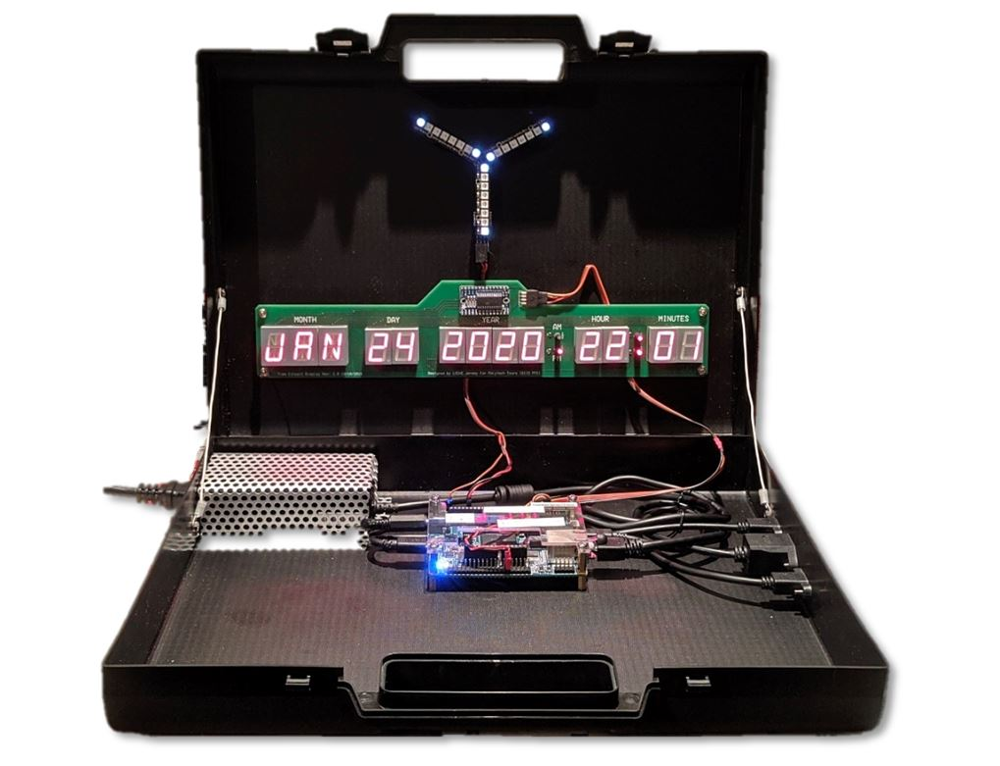

# WBTC
Web Based Time Converter repository, where all the work is set up.

The WBTC is a **Polytech Tours** project aiming at showing all the skills studied in the industrial computer science classes.




Most of the source code is stored here, but to create the full package to install on the DE0-Nano-SOC board, you'll need to access multiple of my repositories.

## For one user, one manual

The **doc** folder is full of documentation resources that you'll use to rebuild this project. If you are an **Administrator, Developer, Maintener, Demonstrator or a Simple User** of the system you'll be able to find exactly what your role is in this project and what you can do with it.

*Check out the [doc folder](doc/) for more information !*

## Making the package to run on the board

On the board you'll find packages for:
1. TimeCircuit driver program and supervisor
2. FPGA firmware and linux programming
3. FluxCapacitor WS2812 LED programs
4. All the system daemons

## Mandatory programs to install from the Internet

Now that you have access to the board using the USB Serial terminal we'll have to deploy all the binaries and programs:

1. **Build Essential:** This is necessary to install the **NodeRED** web services.
2. **Device tree compiler:** This is necessary to **compile the device tree overlay** for the FPGA programming procedure.
3. **NodeRED:** The **full-stack web application** that we use to control the system using the web browser.

```

#Update the repositories
sudo apt-get update

#Install build essential
sudo apt-get install -y build-essential

#Install DTC
sudo apt-get install -y device-tree-compiler

#Install libgpiod and utils
sudo apt-get install -y gpiod libgpiod-dev


#Install NodeRED
bash <(curl -sL https://raw.githubusercontent.com/node-red/linux-installers/master/deb/update-nodejs-and-nodered)
```

## Gathering all the programs

The system on the DE0-Nano-SOC board should already be running the following:


1. [wbtc_manager](/src/wbtc_manager) : base folder with the bases scripts and programs that you will populate with the following files
2. [HPS_WS2812_FrameBuffer_Brightness](/src/HPS_WS2812/sw/HPS_WS2812_FrameBuffer_Brightness/Debug/HPS_WS2812_FrameBuffer_Brightness) : Low level driver for WS2812 LEDs
3. [WS2812_FrameBuffer_Animations](/src/HPS_WS2812/sw/WS2812_FrameBuffer_Animations/Debug/WS2812_FrameBuffer_Animations) : Process in charge of animating the LEDs using the above driver
4. [fpga_firmware.rbf](/src/HPS_WS2812/fpga_firmware.rbf) : the FPGA image to be loaded in the FPGA. Enables the WS2812 driving IP core.
5. [fpga_overlay.dts](/src/HPS_WS2812/sw/dts/fpga_overlay.dts) : the device tree source to be compiled
6. [fpga_overlay.dtbo]() : the device tree blob object to be loaded on boot by **ws2812_fpga_daemon**. This is obtained by running:
``` ~/wbtc_manager/fpga_utils/make_dtbo ~/wbtc_manager/fluxcapacitor/fpga_ws2812/fpga_overlay``` on the board. All is does is to compile the **dts** into a **dtbo** file.
7. [TimeCircuitDisplay](https://github.com/lochej/TimeCircuitDisplay/blob/master/sw/TimeCircuitDisplay/Debug/TimeCircuitDisplay) : The binary program responsible from driving the time circuit display wired up on I2C1 port. This is hosted in another of my repo.


We will create a folder with the given structure:
```
wbtc_manager/
├── install_services.sh
├── fluxcapacitor
│   ├── fluxcapacitor.conf (optional)
│   ├── fluxcapacitorctl.py
│   ├── fluxcapacitord.py
│   ├── fluxcapacitor.service
│   ├── fpga_ws2812
│   │   ├── fpga_firmware.rbf
│   │   ├── fpga_overlay.dtbo (will be compiled on the board)
│   │   ├── fpga_overlay.dts
│   │   ├── HPS_WS2812_FrameBuffer_Brightness
│   │   ├── rgb_fluxcapacitor.py
│   │   └── WS2812_FrameBuffer_Animations
│   ├── ws2812_fpga_daemon
│   └── ws2812_fpga_daemon.service
├── fpga_utils
│   ├── insert_overlay
│   └── make_dtbo
├── GPIO
│   ├── button_poweroff.service
│   ├── button_poweroff.sh
│   ├── gpio_wait_for_event.sh
│   └── led_driving.py
└── timecircuit
    ├── timecircuit.conf (optional)
    ├── timecircuitctl.py
    ├── TimeCircuitDisplay
    ├── timecircuitd.py
    └── timecircuit.service
```

Copy your freshly created **wbtc_manager** folder to the **/home/debian/** directory of your DE0-Nano-SOC board.


Then just run the [install_services.sh](src/wbtc_manager/install_services.sh) file in the **wbtc_manager** folder. It will simply install the files using symlinks and make sure all the rights are enabled.

Once this is done you will finally import the NodeRED flows using the procedure : [NodeRED flows install](src/wbtc_manager/NodeRED/README.md)