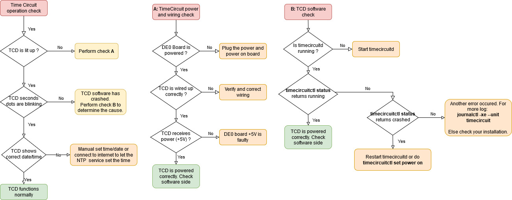
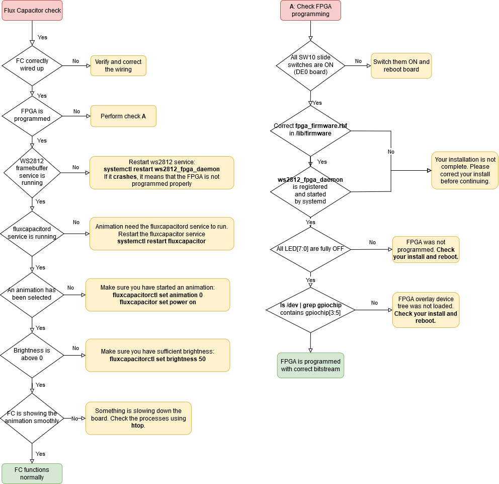

# WBTC Maintener

We you are a maintener of the system, you are going to perform several tests of the system to make sure it is working properly.

The goals are the following:

1. Check the wiring of the system
3. The system boots the debian 10 image
4. Make sure the FPGA is programmed by the Linux system
5. Make sure daemons for the fluxcapacitor and timecircuit are registered and started
6. Make sure NodeRED is deployed and running

We will analyse different failure cases for you to analyse.

# Normal operating mode

In a normal operating mode the following are valid:

1. NodeRED is available at you **http://[YourBoardIP]:1880** and your dashboarbd is available at **http://[YourBoardIP]:1880/ui**
2. The Flux capacitor is glowing with the selected animation and brightness
3. The Time Circuit Display is on and displaying the correct date with the second indicator blinking.

# Possible Failures

## The time circuit doesn't work properly

Please follow the following diagram to perform a system diagnostic for the **Time Circuit Display** module.

## The flux capacitor doesn't work properly

Please follow the following diagram to perform a system diagnostic for the **Flux Capaictor** module. 

